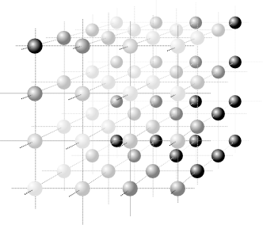
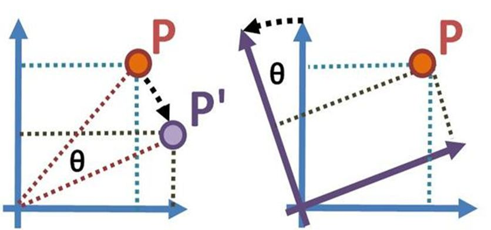

<section id="themes">
	<h2>Themes</h2>
		

			Set your presentation theme:  
			<!-- Hacks to swap themes after the page has loaded. Not flexible and only intended for the reveal.js demo deck. -->
			<a href="#" onclick="document.getElementById('theme').setAttribute('href','css/theme/black.css'); return false;">Black (default)</a> -
			<a href="#" onclick="document.getElementById('theme').setAttribute('href','css/theme/white.css'); return false;">White</a> -
			<a href="#" onclick="document.getElementById('theme').setAttribute('href','css/theme/league.css'); return false;">League</a> -
			<a href="#" onclick="document.getElementById('theme').setAttribute('href','css/theme/sky.css'); return false;">Sky</a> -
			<a href="#" onclick="document.getElementById('theme').setAttribute('href','css/theme/beige.css'); return false;">Beige</a> -
			<a href="#" onclick="document.getElementById('theme').setAttribute('href','css/theme/simple.css'); return false;">Simple</a>  
			<a href="#" onclick="document.getElementById('theme').setAttribute('href','css/theme/serif.css'); return false;">Serif</a> -
			<a href="#" onclick="document.getElementById('theme').setAttribute('href','css/theme/night.css'); return false;">Night</a> -
			<a href="#" onclick="document.getElementById('theme').setAttribute('href','css/theme/moon.css'); return false;">Moon</a> -
			<a href="#" onclick="document.getElementById('theme').setAttribute('href','css/theme/solarized.css'); return false;">Solarized</a>
		

</section>

H:

## Computer Graphics for Video-Games Module

Goal is double:

<li class="fragment"> Get to know *WHAT* can be achieved graphically </li>
<li class="fragment"> Get a fundamental mind map as to *HOW* </li>

H:

## Computer Graphics for Video-Games Module

Audience:
 
  * good for designers and good for developers <!-- .element: class="fragment" data-fragment-index="1"-->
  * but maybe for different reasons <!-- .element: class="fragment" data-fragment-index="2"-->

N: 

  * don't mind to play different roles
  
H:

## Computer Graphics for Video-Games Module

Assumptions:
 
<li class="fragment"> Video-game should run in any (modern) platform </li>
<li class="fragment"> No particularly tied to a specific game-engine </li>
<li class="fragment"> Math background: [linear algebra](http://en.wikipedia.org/wiki/Linear_algebra) and [affine transformations](http://en.wikipedia.org/wiki/Affine_transformation) </li>

N:

 * means opengl2
 * means simple glsl
 * means math can get tougher

* Goal: Efficiency and Effectiveness
* Class 1 CG Intro
* Class 2 Shaders
* Classes 3-5 Modelling
TODO: goal for this class or the module?
1. Video-game should run in any platform
1. -> mens OpenGL-2
1. knowing some high-level optimization techniques
  2. Knowing about their existance (independently of the underlying game engine)
1. Knowing how to spatially organize a scene
1. Medio plazo estos repos -> lugar de referencia

H:

## Introduction to Computer Graphics

Jean Pierre Charalambos

H:

## Contents

1. Introduction <!-- .element: class="fragment" data-fragment-index="1"-->
2. Speeding-up techniques <!-- .element: class="fragment" data-fragment-index="2" -->
3. Scene-Graphs <!-- .element: class="fragment" data-fragment-index="3" -->
4. Lighting and Texturing <!-- .element: class="fragment" data-fragment-index="4" -->
5. Conclusions <!-- .element: class="fragment" data-fragment-index="5" -->

H: 

## Introduction

### Rasterization and triangular meshes

V: 

## Introduction

### Rasterization and triangular meshes

V: 

## Introduction

### Rasterization and triangular meshes

V: 

## Introduction

### Other representations: BSPs

N:

Just to name few among others

V: 

## Introduction

### Other representations: BSPs

<figure>
    
    <figcaption><a href="http://en.wikipedia.org/wiki/Constructive_solid_geometry">Constructive Solid Geometry</a></figcaption>
</figure>

N:

CSG can be implemented by other means (no BPS)

V:

## Introduction

### Other representations: BSPs

<figure>
    
    <figcaption><a href="http://en.wikipedia.org/wiki/Ray_tracing_(graphics)">Ray Tracing</a></figcaption>
</figure>

V:

## Introduction

### Other representations: BSPs

<figure>
    
    <figcaption>Ray Tracing Scene</a></figcaption>
</figure>

V:

## Introduction

### Other representations: Voxels

<figure>
    
    <figcaption><a href="http://en.wikipedia.org/wiki/Voxel">Voxel</a></figcaption>
</figure>

V:

## Introduction

### Other representations: Voxels

<figure>
    
    <figcaption>Example 1</a></figcaption>
</figure>

V:

## Introduction

### Other representations: Voxels

<figure>
    
    <figcaption>Example 2</a></figcaption>
</figure>

V:

## Introduction

### Other representations: Voxels

<figure>
    
    <figcaption><a href="http://en.wikipedia.org/wiki/Volume_rendering">Volume Rendering: Shear Warp</a></figcaption>
</figure>

V:

## Introduction

### Other representations: Voxels

<figure>
    
    <figcaption><a href="http://en.wikipedia.org/wiki/Volume_rendering">Volume Rendering: MIP</a></figcaption>
</figure>

N:

(M)aximum (I)ntensity (P)rojection

V:

## Introduction
### Transformations (2D case)

V:

## Introduction
### Transformations (2D case)

<table>
<tr>
	<td colspan=2>Translation</td>

</tr>
<tr>
	<td>
$ P'=T(dx,dy) \bullet P $
	</td>
	<td>
$ T=\begin{bmatrix} 
1 & 0 & dx \cr 
0 & 1 & dy \cr 
0 & 0 & 1 \end{bmatrix} $
	</td>
</tr>
<tr>
	<td colspan=2>Scaling</td>
</tr>
<tr>
	<td>
$P'=S(sx,sy) \bullet P$
	</td>
	<td>
$
S=\begin{bmatrix} 
s_x & 0 & 0 \cr 
0 & s_y & 0 \cr
0 & 0 & 1\end{bmatrix}
$
	</td>
</tr>
<tr>
	<td colspan=2>Rotation</td>
</tr>
<tr>
	<td>
$P'=R(\beta) \bullet P$
	</td>
	<td>
$R=\begin{bmatrix} 
cos\beta & -sin \beta  & 0 \cr 
sin \beta & cos \beta & 0 \cr
0 & 0 & 1
\end{bmatrix}
$
	</td>
</tr>
</table>

V:

## Introduction
### Transformations (2D case)

Why three dimensions?

V:

## Introduction
### Transformations (2D case)

Because homogeneous space:

<table>
<tr>
<td>

</td>
<td>
Homogeneous coordinates $(x,y,w)$ 

2D $\rightarrow$ Homogeneous Space  

$(x,y) \rightarrow (x,y,1)$
$(\frac xw, \frac yw) \rightarrow (x,y,w)$  

3D $\rightarrow$ Homogeneous Space 

$ (x,y,z) \rightarrow (x,y,z,1) $
$(\frac xw, \frac yw, \frac zw) \rightarrow (x,y,z,w)$
</td>
</tr>
</table>

V:

## Introduction
### Transformations

Imagine 3d

V:

## Introduction
### Transformations

The above transformations (rotate, traslate and scaling):

  1. may be concataneted <!-- .element: class="fragment" data-fragment-index="1"-->
  1. are invertible <!-- .element: class="fragment" data-fragment-index="2"-->
  1. typically occured over the trimesh vertices <!-- .element: class="fragment" data-fragment-index="3"-->
  
even in 3d! <!-- .element: class="fragment" data-fragment-index="4"-->

V:

## Introduction
### Camera transformation

Remember from a previous class [Brunelleschi](http://en.wikipedia.org/wiki/Filippo_Brunelleschi)'s Experiment:

<section>
	<iframe width="420" height="345" src="http://www.youtube.com/embed/bkNMM8uiMww"></iframe>
</section>

V:

## Introduction
### Camera transformation

V:

## Introduction
### Camera transformation

V:

## Introduction
### Camera transformation

V:

## Introduction
### Camera transformation

* Zoom $\leftrightarrow$ Scaling toward x and y $(S)$
* Zoom out = Shrink $(S<1) \rightarrow$ FOV increases
* Zoom in = Expand $(S<1) \rightarrow$ FOV decreases

$\begin{bmatrix} 
S & 0 & 0 & 0 \cr 
0 & S & 0 & 0 \cr
0 & 0 & {-f \above 1pt (f-n)} & -1 \cr
0 & 0 & {-nf \above 1pt (f-n)} & 1\end{bmatrix}$

V:

## Introduction
### Camera transformation

The camera transformation:

  * 3D (world) -> 2D (screen)
  * so isn't invertible <!-- .element: class="fragment" data-fragment-index="2"-->

V:

## Introduction
### Camera transformation

examples

V:

## Introduction

### The graphics pipeline

V:

## Introduction

### Conclusion

$pipeline = fx(trimesh, raster, transformations)$

H:

## Speeding-up techniques

<figure>
    
    <figcaption>Application domain</a></figcaption>
</figure>

V:

## Speeding-up techniques
### LODs

<figure>
    
    <figcaption>Massive polygonal model</a></figcaption>
</figure>

V:

## Speeding-up techniques
### LODs

<figure>
    
    <figcaption>Model simplifications</a></figcaption>
</figure>

V:

## Speeding-up techniques
### LODs

<figure>
    
    <figcaption>Discrete LOD</a></figcaption>
</figure>

V:

## Speeding-up techniques
### LODs

<figure>
    
    <figcaption>Variable LOD</a></figcaption>
</figure>

V:

## Speeding-up techniques
### HLODs

<figure>
    
    <figcaption>HLODs hierarchical subdivision</figcaption>
</figure>

V:

## Speeding-up techniques
### HLODs

<figure>
    
    <figcaption><a href="https://www.youtube.com/watch?v=DUtsid6ioFw">HLODs example</a></figcaption>
</figure>

V:

## Speeding-up techniques
### HLODs

<figure>
    
    <figcaption><a href="https://www.youtube.com/watch?v=DUtsid6ioFw">HLODs example</a></figcaption>
</figure>

V:

## Speeding-up techniques
### BSPs

<figure>
    
    <figcaption>Back to BSP's</figcaption>
</figure>

V:

## Speeding-up techniques
### BSPs

<figure>
    
    <figcaption>BSP as a <a href="http://en.wikipedia.org/wiki/Hidden_surface_determination">HSR</a> algorithm</figcaption>
</figure>

V:

## Speeding-up techniques
### BSPs

<li class="fragment">Good for static but awful for dynamic</li>
<li class="fragment">Typically used in combination with the [Z-Buffer](http://en.wikipedia.org/wiki/Z-buffering)</li>
<li class="fragment">Excellent for [first person shooter](http://en.wikipedia.org/wiki/First-person_shooter) games (indoor games)</li>
<li class="fragment">Implemented by [Quake](http://en.wikipedia.org/wiki/Quake_(video_game) and [Doom](http://en.wikipedia.org/wiki/Doom_(1993_video_game)</li>
<li class="fragment">Available in Quake and Doom-like video-game engines</li>

H:

## Scenegraphs

<figure>
    
    <figcaption>Vertex shader</a></figcaption>
</figure>

V:

## Scenegraphs
### Active vs Passive Transformations

V:

## Scenegraphs
### Data structure

<figure>
    
    <figcaption><a href="http://en.wikipedia.org/wiki/Scene_graph">Scene graph</a></figcaption>
</figure>

V:

## Scenegraphs
### Matrix stack

<figure>
    
    <figcaption>Model-View matrix stack</figcaption>
</figure>

V:

## Scenegraphs
### Features

<li class="fragment">A node may have many children but only a single parent</li>
<li class="fragment">An op. performed on a node propagates its effect down</li>
<li class="fragment">A node perform an op. respect to its parent</li>
<li class="fragment">Nodes in a scene graph represent a _transformation_</li>
<li class="fragment">Objects may be added to nodes -> logical relationships</li>

V:

## Scenegraphs
### Applications

<li class="fragment">Dynamic spatial organization of scene objects</li>
<li class="fragment">Picking & Interaction</li>
<li class="fragment">Direct kinematics</li>
<li class="fragment">(more challenging) inverse kinematics</li>

V:

## Scenegraphs
### Applications

Examples

H:

## Lighting and Texturing

<figure>
    
    <figcaption>Fragment shader</a></figcaption>
</figure>

V:

## Lighting and Texturing

<figure>
    
    <figcaption><a href="http://en.wikipedia.org/wiki/UV_mapping">UV Texture mapping</a></figcaption>
</figure>

V:

## Lighting and Texturing

Examples

V:

## Lighting and Texturing

<figure>
    
    <figcaption>Multi-texturing</figcaption>
</figure>

V:

## Lighting and Texturing

<figure>
    
    <figcaption><a href="http://fabiensanglard.net/bumpMapping/index.php">Bump-Mapping</a></figcaption>
</figure>

V:

## Lighting and Texturing

In bump-mapping meshes are not altered:
<figure>
    
</figure>

V:

## Lighting and Texturing

Examples

V:

## Lighting and Texturing

<figure>
    
    <figcaption><a href="http://en.wikipedia.org/wiki/Displacement_mapping">Displacement-Mapping</a></figcaption>
</figure>
Current implementations does it at the vertex shader

V:

## Lighting and Texturing

<figure>
    
    <figcaption><a href="http://en.wikipedia.org/wiki/Mipmap">Mip-Mapping</a></figcaption>
</figure>

V:

## Lighting and Texturing

Other effects as reflection mapping are left as homework

H:

## Conclusions

<li class="fragment"> Looking for mathematical background is always good, begin with [linear algebra](http://en.wikipedia.org/wiki/Linear_algebra) and [affine transformations](http://en.wikipedia.org/wiki/Affine_transformation)</li>
<li class="fragment"> ... if in doubt don't hesitate to ask your engineering student partners ;) </li>

<li class="fragment"> There's a process comprising the stages to render an image called the _graphics pipeline_</li>
<li class="fragment"> What can be achieved graphically mostly depends on which stage of that process we are:</li>

V:

## Conclusions

... for instance:

 * Speeding-up techniques -> pre-processing <!-- .element: class="fragment" data-fragment-index="1"-->
 * Scene-graphs (& models) -> pre-processing, vertex shader <!-- .element: class="fragment" data-fragment-index="2"-->
 * Special graphics effects -> fragment shader <!-- .element: class="fragment" data-fragment-index="3"-->

 ... but with great exceptions! <!-- .element: class="fragment" data-fragment-index="4"-->
 
N:
 
 1. real time ray-tracing
 2. lods at the geometry shader